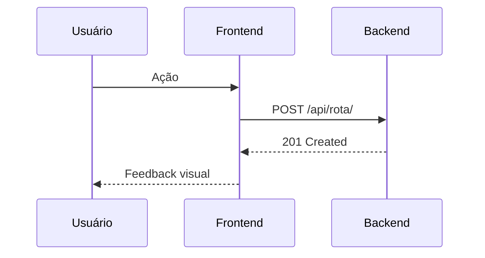

# Sync Docs

Sincroniza a documentação do projeto com o estado atual do código. Funciona sem task — pode ser invocado a qualquer momento.

## Mapa de Documentação do Projeto

```
docs/
├── backend/
│   ├── api.md          → ViewSets e endpoints REST
│   ├── crons.md        → Tasks do Celery Beat
│   ├── entidades.md    → Models (campos, relacionamentos)
│   ├── fluxos.md       → Fluxos do backend em Mermaid (sequência)
│   ├── manifesto.md    → Stack, libs e estrutura Django
│   ├── services.md     → Services da aplicação
│   └── signals.md      → Signals (evento, sender, ação)
├── frontend/
│   ├── componentes.md  → Componentes React globais (props, uso)
│   ├── estado.md       → Hooks customizados (params, retorno)
│   ├── history-book.md → Stories (.stories.tsx) descritos
│   ├── manifesto.md    → Stack, libs e estrutura Next.js
│   └── paginas.md      → Pages (rota, resumo, server/client)
├── fluxos.md           → Fluxos E2E em Mermaid
├── funcionalidades.md  → Funcionalidades do sistema
├── glossario.md        → Termos de domínio e significados
├── guidelines.md       → Convenções de código (raramente atualizado)
└── manifesto.md        → Visão geral, escopo e propósito do projeto
```

## Passo 1 — Identificar o Escopo da Sincronização

Verifique o que mudou recentemente:

```bash
# Mudanças staged ou recentes
git diff --staged --name-only 2>/dev/null
git diff HEAD~3 --name-only 2>/dev/null
git status --short 2>/dev/null
```

Se não há mudanças recentes claras (usuário quer sync geral), escanear o codebase completo conforme Passo 2.

## Passo 2 — Tabela de Roteamento

Para cada arquivo alterado (ou ao fazer sync geral), use a tabela:

| Código alterado | Doc a atualizar |
|---|---|
| `backend/**/views.py`, `**/urls.py` | `docs/backend/api.md` |
| `backend/**/tasks.py` (Celery) | `docs/backend/crons.md` |
| `backend/**/models.py`, `**/choices.py` | `docs/backend/entidades.md` |
| `backend/**/services.py` | `docs/backend/services.md` |
| `backend/**/signals.py` | `docs/backend/signals.md` |
| `backend/**/serializers.py`, `**/filters.py` | `docs/backend/api.md` |
| `docker-compose*`, `settings.py`, `pyproject.toml` | `docs/backend/manifesto.md` |
| `frontend/src/components/**` | `docs/frontend/componentes.md` |
| `frontend/src/hooks/**`, `frontend/src/contexts/**` | `docs/frontend/estado.md` |
| `frontend/src/**/*.stories.tsx` | `docs/frontend/history-book.md` |
| `frontend/src/app/**/page.tsx` | `docs/frontend/paginas.md` |
| `frontend/package.json`, `frontend/src/app/providers.tsx` | `docs/frontend/manifesto.md` |
| Novos fluxos E2E, regras de negócio end-to-end | `docs/fluxos.md` |
| Novas features implementadas | `docs/funcionalidades.md` |
| Novos termos de domínio identificados no código | `docs/glossario.md` |

**Nunca atualizar** `docs/guidelines.md` a menos que a estrutura do código esteja completamente diferente do que está documentado.

## Passo 3 — Coletar Informações do Código

Para cada categoria identificada, colete os dados necessários:

### backend/api.md — ViewSets
```bash
find backend/ -name "views.py" | xargs grep -h "class.*ViewSet\|@action\|@extend_schema" 2>/dev/null
find backend/ -name "urls.py" | xargs grep -h "router.register\|path(" 2>/dev/null
```

### backend/crons.md — Tasks Celery
```bash
find backend/ -name "tasks.py" | xargs grep -h "@shared_task\|@app.task\|def " 2>/dev/null
```

### backend/entidades.md — Models
```bash
find backend/ -name "models.py" | xargs grep -h "class .*Model\|class.*BaseModel\|    [a-z].*= models\." 2>/dev/null | head -60
```

### backend/services.md — Services
```bash
find backend/ -name "services.py" | xargs grep -h "class.*Service\|    def " 2>/dev/null
```

### backend/signals.md — Signals
```bash
find backend/ -name "signals.py" | xargs grep -h "@receiver\|def " 2>/dev/null
```

### frontend/componentes.md — Componentes
```bash
find frontend/src/components -name "index.tsx" 2>/dev/null | sort
```

### frontend/estado.md — Hooks
```bash
find frontend/src/hooks -name "*.ts" -o -name "*.tsx" 2>/dev/null | sort
find frontend/src/contexts -name "*.tsx" 2>/dev/null | sort
```

### frontend/history-book.md — Stories
```bash
find frontend/src -name "*.stories.tsx" 2>/dev/null | sort
```

### frontend/paginas.md — Pages
```bash
find frontend/src/app -name "page.tsx" 2>/dev/null | sort
```

## Passo 4 — Ler e Atualizar Cada Doc

Para cada arquivo de doc a ser atualizado:

1. **Ler o arquivo** antes de qualquer edição:
   ```
   Read("docs/backend/api.md")
   ```

2. **Identificar o formato existente** — tabelas, listas, seções Mermaid

3. **Editar cirurgicamente** — nunca reescrever o arquivo inteiro, apenas adicionar/atualizar a seção relevante

4. **Manter o padrão existente** — se o arquivo usa tabelas, adicionar como linha; se usa seções H2, adicionar na seção certa

5. **Aplicar wikilinks Obsidian** — ao mencionar entidades do projeto, linkar conforme o mapa abaixo

## Padrão Obsidian — Wikilinks e Frontmatter

Toda documentação segue o estilo **Obsidian Flavored Markdown**. Ao adicionar ou editar seções, aplicar as regras abaixo.

> Para referência completa de sintaxe Obsidian (wikilinks, embeds, callouts, frontmatter), invoke `obsidian-markdown`.
> Para referência completa de comandos CLI (`search`, `read`, `append`, `backlinks`), invoke `obsidian-cli`.

### Regras de Wikilinks

- Usar `[[destino#Seção|Texto]]` ao mencionar entidades do projeto pela primeira vez em cada seção
- **Nunca** colocar wikilinks dentro de blocos de código ou diagramas Mermaid
- Wikilinks são contextuais: aparecem onde o termo é mencionado, não apenas no rodapé
- A linha "Veja também:" no topo do arquivo deve ser mantida/atualizada se novos relacionamentos surgirem

### Mapa de Wikilinks por Entidade

| Quando mencionar | Usar wikilink |
|---|---|
| `IncomingEvent` | `[[backend/entidades#IncomingEvent\|IncomingEvent]]` |
| `OutgoingEvent` | `[[backend/entidades#OutgoingEvent\|OutgoingEvent]]` |
| `EventSource` | `[[backend/entidades#EventSource\|EventSource]]` |
| `EventSourceRateLimit` | `[[backend/entidades#EventSourceRateLimit\|EventSourceRateLimit]]` |
| `EventSourceSubscription` | `[[backend/entidades#EventSourceSubscription\|EventSourceSubscription]]` |
| `EventDestination` | `[[backend/entidades#EventDestination\|EventDestination]]` |
| `EventDestinationSubscription` | `[[backend/entidades#EventDestinationSubscription\|EventDestinationSubscription]]` |
| `TaskEvent` | `[[backend/entidades#TaskEvent\|TaskEvent]]` |
| `PedidoOmie` | `[[backend/entidades#PedidoOmie\|PedidoOmie]]` |
| `IncomingEventService` | `[[backend/services#IncomingEventService\|IncomingEventService]]` |
| `EventEmitterService` | `[[backend/services#EventEmitterService\|EventEmitterService]]` |
| `RedisRateLimitService` | `[[backend/services#RedisRateLimitService\|RedisRateLimitService]]` |
| `RedisLockService` | `[[backend/services#RedisLockService\|RedisLockService]]` |
| `PedidoOmieSyncService` | `[[backend/services#PedidoOmieSyncService\|PedidoOmieSyncService]]` |
| `dispatch_incoming_event` / dispatcher | `[[backend/services#dispatch_incoming_event\|dispatcher]]` |
| `BaseWebhookHandler` / handler | `[[backend/services#BaseWebhookHandler / BaseOmieHandler\|handler]]` |
| `process_incoming_event` (task) | `[[backend/crons#process_incoming_event\|process_incoming_event]]` |
| `deliver_webhook_task` | `[[backend/crons#deliver_webhook_task\|deliver_webhook_task]]` |
| `sync_pedido_omie_task` | `[[backend/crons#sync_pedido_omie_task\|sync_pedido_omie_task]]` |
| Endpoint de recepção de webhook | `[[backend/api#EventSourceWebhookView\|EventSourceWebhookView]]` |
| `IncomingEventViewSet` | `[[backend/api#IncomingEventViewSet\|IncomingEventViewSet]]` |
| `OutgoingEventViewSet` | `[[backend/api#OutgoingEventViewSet\|OutgoingEventViewSet]]` |
| `EventDestinationViewSet` | `[[backend/api#EventDestinationViewSet\|EventDestinationViewSet]]` |
| `PedidoOmieViewSet` | `[[backend/api#PedidoOmieViewSet\|PedidoOmieViewSet]]` |
| Fluxo E2E (negócio) | `[[fluxos#Nome do Fluxo]]` |
| Fluxo técnico backend | `[[backend/fluxos#Nome do Fluxo]]` |
| Termo do glossário | `[[glossario#Termo\|Termo]]` |

### Frontmatter — Quando Criar Novo Arquivo de Doc

Se o sync exigir criar um arquivo de doc novo (raro), incluir frontmatter:

```yaml
---
title: Nome Legível
tags:
  - backend   # ou frontend
  - domínio   # ex: models, api, tasks, componentes
aliases:
  - Alias Alternativo
---
```

Tags sugeridas por arquivo:
- `backend/entidades.md` → `backend`, `models`
- `backend/api.md` → `backend`, `api`, `endpoints`
- `backend/services.md` → `backend`, `services`
- `backend/crons.md` → `backend`, `celery`, `tasks`
- `backend/fluxos.md` → `backend`, `fluxos`, `mermaid`
- `frontend/componentes.md` → `frontend`, `componentes`
- `frontend/paginas.md` → `frontend`, `páginas`, `rotas`
- `frontend/estado.md` → `frontend`, `hooks`, `estado`

### Atualizar index.md

Se uma nova entidade ou seção significativa for adicionada, verificar se `docs/index.md` precisa de ajuste na entrada correspondente.

## Formatos Padrão por Arquivo

### api.md
```markdown
## [NomeViewSet]

**Endpoint:** `GET/POST /api/[rota]/`

ViewSet para [[backend/entidades#NomeModel|NomeModel]]. Criado/atualizado via [[backend/services#NomeService|NomeService]].

| Ação | Método | URL | Descrição |
|------|--------|-----|-----------|
| list | GET | `/api/rota/` | Lista todos |
| create | POST | `/api/rota/` | Cria novo |
| flat | GET | `/api/rota/flat/` | Lista compacta |
```

### entidades.md
```markdown
## [NomeModel]

> Descrição curta do que representa.

**App:** `apps.nome_app`

| Campo | Tipo | Descrição |
|-------|------|-----------|
| `id` | AutoField | Identificador único |
| `campo` | CharField | Descrição |

**Relacionamentos:** `campo_fk` ([[backend/entidades#OutroModel|OutroModel]])

**Métodos:** `mark_as_done()`, `mark_as_failed()`
```

### services.md
```markdown
## [NomeService]

**Arquivo:** `apps/nome/services.py`
**Responsabilidade:** O que este service processa — mencionar [[backend/entidades#ModelRelacionado|ModelRelacionado]] se aplicável.

| Método | Parâmetros | Retorna | Descrição |
|--------|-----------|---------|-----------|
| `executar()` | — | Model | Descrição |
```

### crons.md
```markdown
## [nome_da_task]

**App:** `apps.nome`
**Fila:** `nome_da_fila`
**Agendamento:** sob demanda / periódica

Processa [[backend/entidades#ModelRelacionado|ModelRelacionado]] via [[backend/services#NomeService|NomeService]]. Ver [[backend/fluxos#Nome do Fluxo]].
```

### componentes.md
```markdown
## [NomeComponente]

**Localização:** `src/components/NomeComponente/`
**Uso:** Em quais [[frontend/paginas#/rota|páginas]] é usado.

| Prop | Tipo | Obrigatório | Descrição |
|------|------|-------------|-----------|
| `data` | `Tipo[]` | sim | Descrição |
```

### paginas.md
```markdown
## /rota/da/pagina

**Arquivo:** `src/app/(private)/rota/page.tsx`
**Tipo:** Server Component / Client Component
**Descrição:** O que esta página exibe. Usa [[frontend/componentes#NomeComponente|NomeComponente]] e consome [[backend/api#NomeViewSet|endpoint]].
```

### fluxos.md e docs/backend/fluxos.md
Usar diagramas Mermaid de sequência. Adicionar parágrafo de contexto com wikilinks **antes** do bloco Mermaid:

```markdown
## Nome do Fluxo

Envolve [[backend/entidades#IncomingEvent|IncomingEvent]], [[backend/services#NomeService|NomeService]] e [[backend/crons#nome_task|nome_task]].


```

### funcionalidades.md
```markdown
## [Nome da Funcionalidade]

**Status:** ✅ Implementada / 🚧 Em desenvolvimento / 📋 Planejada
**Descrição:** O que o usuário consegue fazer. Ver [[backend/api#NomeViewSet]] e [[fluxos#Nome do Fluxo]].
```

### glossario.md
```markdown
| **NovoTermo** | Definição clara. Ver [[backend/entidades#ModelRelacionado\|ModelRelacionado]] se for uma entidade do sistema. |
```

## Passo 5 — Confirmar com o Usuário

Ao final, listar os arquivos atualizados:

```
Docs atualizados:
- docs/backend/api.md → adicionado endpoint TransactionViewSet
- docs/backend/entidades.md → adicionado model BankAccount
- docs/frontend/paginas.md → adicionada página /transactions

Docs não atualizados (sem mudanças):
- docs/guidelines.md (estrutura segue as convenções)
- docs/manifesto.md (propósito do projeto não mudou)
```
