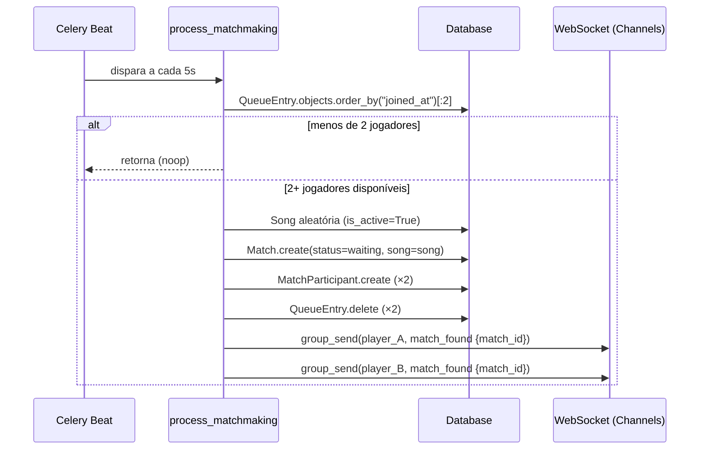
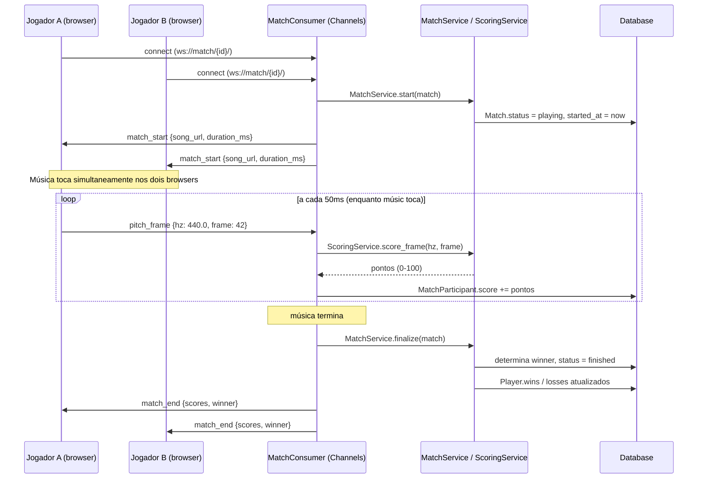

# Backend Fluxos

> Fluxos tecnicos do backend.

Veja também: [[fluxos]] · [[backend/entidades]] · [[backend/services]] · [[backend/crons]]

---

## Fluxo de Matchmaking

O Celery Beat roda `process_matchmaking` periodicamente e cria partidas quando há pelo menos 2 jogadores na fila.

---

## Fluxo de Batalha (WebSocket)

Após receber `match_found`, ambos os jogadores conectam na sala da partida.

---

## Estados da Match

| Status | Descrição |
|--------|-----------|
| `waiting` | Criada, aguardando os dois players conectarem via WebSocket |
| `playing` | Música tocando, frames de pitch sendo recebidos |
| `finished` | Música terminou, vencedor determinado |
| `cancelled` | Um jogador desconectou antes do fim |
