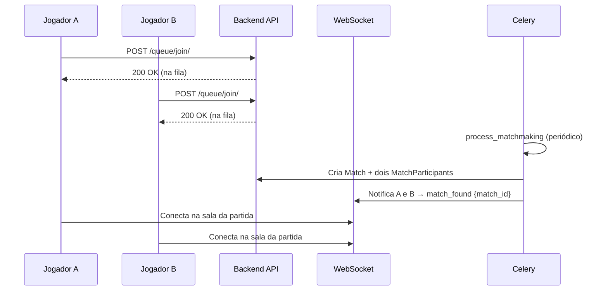
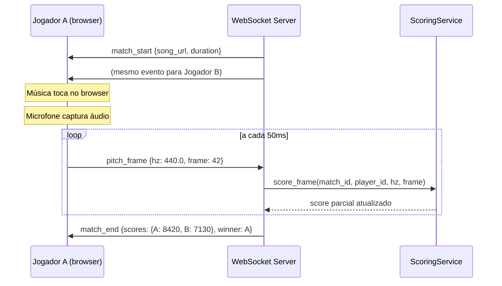

# Fluxos

> Fluxos-chave de negocio e operacao.

Veja também: [[backend/fluxos]] · [[backend/entidades]] · [[backend/services]] · [[glossario]]

---

## Matchmaking

Um jogador entra na fila e é pareado com outro para iniciar uma partida.

---

## Batalha e Pontuação em Tempo Real

A partida começa quando ambos os jogadores estão conectados na sala WebSocket.

---

## Resultado e Atualização de Ranking

Ao fim da partida, o servidor finaliza os registros e atualiza o ranking.

1. `MatchService.finalize(match)` determina o vencedor comparando `MatchParticipant.score` de cada jogador
2. Atualiza `Match.winner` e `Match.status = finished`
3. Atualiza `Player.wins` / `Player.losses` de cada jogador
4. O frontend exibe o resultado e redireciona para o ranking
